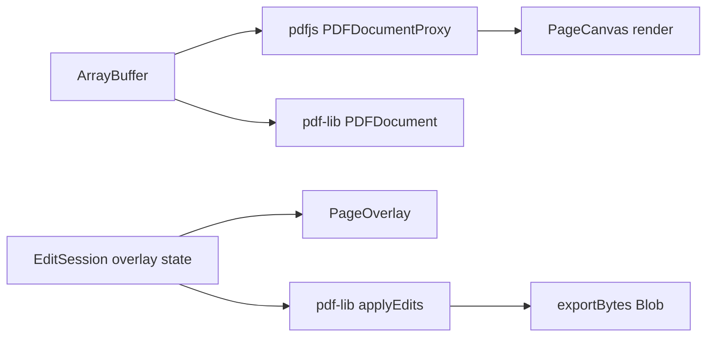

> **Historical artifact:** This file is the original Cursor Plan-mode output from before implementation. It describes intended scope, structure, and phased delivery—not the final shipped MVP. For what was actually built and validated, see [`C/validation.md`](validation.md) and [`C/ai-change-log.md`](ai-change-log.md). Do not treat unchecked plan items or deferred phases here as current product gaps unless they also appear in those delivery documents.

# PDF Viewer/Editor MVP — Implementation Plan

## Scope (MVP)

**In:** Open local PDF, paginated canvas view, zoom/pan, text search/highlight (read), add text annotations, basic page ops (rotate, delete, reorder), save/export modified PDF.

**Out (defer):** Multi-user, server storage, OCR, form filling, digital signatures, collaborative cursors, full WYSIWYG text editing inside original text runs.

---

## 1. File Structure

```
pdf-viewer-editor/
├── A/                                    # App code
│   ├── index.html
│   ├── vite.config.ts
│   ├── tsconfig.json
│   ├── package.json
│   ├── public/
│   │   └── pdf.worker.min.mjs            # pdfjs worker (copied or bundled)
│   └── src/
│       ├── main.tsx
│       ├── App.tsx
│       ├── vite-env.d.ts
│       ├── types/
│       │   ├── pdf.ts                    # DocumentMeta, PageIndex, Viewport
│       │   └── edits.ts                  # Annotation, PageOp, EditSession
│       ├── lib/
│       │   ├── pdfjs/
│       │   │   ├── setupWorker.ts        # GlobalWorkerOptions + worker URL
│       │   │   ├── loadDocument.ts       # getDocument, destroy lifecycle
│       │   │   ├── renderPage.ts         # page.render → canvas
│       │   │   └── textSearch.ts         # getTextContent + match index
│       │   ├── pdfLib/
│       │   │   ├── loadBytes.ts          # PDFDocument.load(ArrayBuffer)
│       │   │   ├── applyEdits.ts         # map EditSession → pdf-lib ops
│       │   │   └── exportBytes.ts        # save() → Uint8Array/Blob
│       │   └── fileIO.ts                 # FileReader, download blob
│       ├── state/
│       │   ├── store.ts                  # Zustand (or React context) root store
│       │   ├── selectors.ts
│       │   └── actions/
│       │       ├── documentActions.ts
│       │       ├── viewActions.ts
│       │       └── editActions.ts
│       ├── hooks/
│       │   ├── usePdfDocument.ts
│       │   ├── usePageRenderer.ts
│       │   ├── useDebouncedRender.ts
│       │   └── useKeyboardShortcuts.ts
│       ├── components/
│       │   ├── layout/
│       │   │   ├── AppShell.tsx
│       │   │   ├── Toolbar.tsx
│       │   │   └── StatusBar.tsx
│       │   ├── viewer/
│       │   │   ├── PdfViewer.tsx         # scroll container + page list
│       │   │   ├── PageCanvas.tsx        # canvas + overlay layer
│       │   │   ├── PageOverlay.tsx       # annotations, selection boxes
│       │   │   ├── ThumbnailStrip.tsx    # optional MVP sidebar
│       │   │   └── ZoomControls.tsx
│       │   ├── editor/
│       │   │   ├── ToolPalette.tsx       # select | text | rotate | delete
│       │   │   ├── TextAnnotationEditor.tsx
│       │   │   └── PageOpsPanel.tsx
│       │   ├── search/
│       │   │   └── SearchPanel.tsx
│       │   └── common/
│       │       ├── FileDropzone.tsx
│       │       ├── LoadingSpinner.tsx
│       │       └── ErrorBanner.tsx
│       └── styles/
│           └── globals.css
├── B/
│   └── ARCHITECTURE.md                   # Data flow, dual-library roles, limits
└── C/
    └── cursor-log.md                     # Session notes, decisions, blockers
```

**Dependency sketch:** `react`, `react-dom`, `pdfjs-dist`, `pdf-lib`, `zustand` (optional but recommended for non-trivial edit state).

---

## 2. Components

| Component | Responsibility |
|-----------|----------------|
| **AppShell** | Layout grid: toolbar, viewer, optional side panels |
| **FileDropzone** | Drag/drop + file input; emits `ArrayBuffer` |
| **Toolbar** | Open, Save, Undo/Redo (if in MVP), tool mode toggle |
| **PdfViewer** | Virtualized or simple mapped list of pages; owns scroll + current page |
| **PageCanvas** | Renders pdfjs page to `<canvas>` at devicePixelRatio-aware scale |
| **PageOverlay** | Absolute-positioned layer for annotations and hit targets (PDF user space → screen) |
| **ToolPalette** | Active tool: `select`, `addText`, `rotatePage`, `deletePage` |
| **TextAnnotationEditor** | Inline input for new text; commits `TextAnnotation` edit |
| **PageOpsPanel** | Rotate/delete/reorder current page |
| **SearchPanel** | Query input, match list, jump-to-match highlight |
| **StatusBar** | Page x/y, zoom %, dirty flag, export status |
| **ErrorBanner** | Corrupt PDF, worker failure, export errors |

**Render pipeline (per page):**



- **pdfjs-dist:** display, text extraction, search geometry.
- **pdf-lib:** authoritative write model for export (embed fonts minimally: standard Helvetica or bundled font bytes).

---

## 3. State Model

Single store with three slices. Keep **source bytes** immutable; track **edit overlay** separately until export.

### Document slice

```ts
type DocumentSlice = {
  sourceBytes: ArrayBuffer | null;
  fileName: string | null;
  pdfjsDoc: PDFDocumentProxy | null;   // runtime handle, not serialized
  pdfLibDoc: PDFDocument | null;       // runtime handle
  pageCount: number;
  loadStatus: 'idle' | 'loading' | 'ready' | 'error';
  loadError: string | null;
};
```

### View slice

```ts
type ViewSlice = {
  currentPage: number;                  // 1-based
  scale: number;                        // e.g. 1.0 = 100%
  fitMode: 'width' | 'page' | 'custom';
  scrollOffset: { x: number; y: number };
  searchQuery: string;
  searchMatches: SearchMatch[];         // page, quad bounds, index
  activeMatchIndex: number;
};
```

### Edit slice

```ts
type TextAnnotation = {
  id: string;
  pageIndex: number;
  x: number; y: number;                 // PDF points, bottom-left origin
  text: string;
  fontSize: number;
  color: string;
};

type PageOp =
  | { type: 'rotate'; pageIndex: number; degrees: 90 | 180 | 270 }
  | { type: 'delete'; pageIndex: number }
  | { type: 'reorder'; from: number; to: number };

type EditSlice = {
  annotations: TextAnnotation[];
  pageOps: PageOp[];
  activeTool: 'select' | 'addText' | 'rotate' | 'delete';
  selectedAnnotationId: string | null;
  isDirty: boolean;
  history: EditSnapshot[];              // optional MVP: last N snapshots
  historyIndex: number;
};
```

### Key invariants

1. **Dual handles, one buffer:** Load same `ArrayBuffer` into both libraries on open; clone buffer if either library mutates underlying memory.
2. **Overlay-first edits:** UI shows annotations immediately on overlay; pdf-lib applies on Save only (simpler MVP) *or* incremental sync (more complex).
3. **Page index discipline:** Store 0-based internally; UI shows 1-based.
4. **Coordinate transform:** Central util `viewportToPdf(page, clientX, clientY)` and inverse for overlay placement.
5. **Teardown:** On new file load, call `pdfjsDoc.destroy()` and drop pdf-lib reference to avoid worker/memory leaks.

### Actions (minimal set)

- `openFile(bytes, name)` → init both docs, reset edit/view state
- `setScale`, `setCurrentPage`, `runSearch`, `jumpToMatch`
- `addAnnotation`, `updateAnnotation`, `removeAnnotation`
- `pushPageOp` (rotate/delete/reorder)
- `exportPdf()` → `applyEdits(pdfLibDoc, editSlice)` → download
- `undo` / `redo` (if history enabled)

---

## 4. Build Sequence

Execute in order; each step should be manually verifiable before proceeding.

| Phase | Deliverable | Exit criteria |
|-------|-------------|---------------|
| **0. Scaffold** | Vite React TS in `A/`, deps installed, worker wired in `setupWorker.ts` | Dev server runs; worker loads without console error |
| **1. Read-only viewer** | `FileDropzone` → `loadDocument` → `PdfViewer` + `PageCanvas` | Local PDF renders page 1; scroll shows multiple pages |
| **2. Navigation & zoom** | `ZoomControls`, page jump, fit-width | Scale changes re-render; current page tracked |
| **3. Search** | `textSearch.ts` + `SearchPanel` + highlight on overlay | Find term; next/prev jumps and highlights |
| **4. Edit overlay** | `ToolPalette`, `PageOverlay`, `TextAnnotationEditor` | Click page → add text box; persists in store; visible on reload within session |
| **5. Page ops** | `PageOpsPanel` + store ops | Rotate/delete updates overlay mapping; deleted pages hidden in viewer |
| **6. Export** | `applyEdits.ts` + Save in toolbar | Downloaded PDF opens in external viewer with annotations + page changes |
| **7. UX hardening** | Loading/error states, keyboard shortcuts, dirty prompt | No silent failures; replace-file warns if dirty |
| **8. Docs** | `B/ARCHITECTURE.md`, seed `C/cursor-log.md` | Architecture matches implemented behavior |

**Worker setup note:** Configure `GlobalWorkerOptions.workerSrc` to `/pdf.worker.min.mjs` (public copy) or Vite `?url` import—pick one approach in phase 0 and document in B.

**Recommended MVP export strategy:** *Deferred apply* — accumulate edits in store; on Save, clone pdf-lib doc (or reload from bytes) and apply all ops once. Faster to ship than keeping pdf-lib in sync on every keystroke.

---

## 5. Tradeoffs

| Decision | Choice (MVP) | Tradeoff |
|----------|--------------|----------|
| Dual libraries | pdfjs view + pdf-lib write | Two parsers in memory; simpler than editing via pdfjs API (limited write support) |
| Edit application | Batch on export | Easier correctness; Save latency grows with edit count |
| Rendering | Canvas per page | Sharp at high DPI; many pages = memory use (mitigate: render visible pages only) |
| Annotations | New text drawn by pdf-lib | Does not edit original PDF text streams; good for stamps/labels, not true content edit |
| Page delete/reorder | Logical ops list | Must remap page indices in annotations/search after structural changes |
| State library | Zustand vs Context | Zustand reduces re-render churn for canvas-heavy UI |
| Virtualization | Optional in MVP | Simple map-all-pages OK for &lt;50 pages; virtualize if perf issues |
| Fonts | Standard PDF fonts only | Avoids font file licensing/complexity; limited typography |
| Undo/redo | Snapshot edit slice | Memory cheap for MVP; full PDF byte snapshots too heavy |
| Server | None (client-only) | No auth/persistence; fits Vite static deploy |

**Risk:** pdf-lib reorder/delete changes page indices — centralize `resolvePageIndex(logicalIndex)` after ops before render and export.

---

## 6. Validation Checklist

### Functional

- [ ] Open PDF via button and drag-drop (`.pdf` only)
- [ ] Multi-page document renders; scroll navigates all pages
- [ ] Zoom in/out and fit-to-width preserve crisp rendering
- [ ] Page indicator matches visible page
- [ ] Search finds text; next/prev cycles matches with visible highlight
- [ ] Add text annotation at click position; text appears at correct location after zoom change
- [ ] Rotate page 90°; exported PDF reflects rotation
- [ ] Delete page; viewer hides page; export excludes it
- [ ] Reorder pages (if implemented); export order matches
- [ ] Save downloads valid PDF; opens in Preview/Adobe/browser
- [ ] Open new file while dirty shows confirmation
- [ ] Error UI for corrupt/non-PDF files

### Technical

- [ ] pdfjs worker loads (no main-thread parse warning)
- [ ] `pdfjsDoc.destroy()` on unload/file replace
- [ ] No React state stores non-serializable proxies in persisted storage
- [ ] Canvas scaled by `devicePixelRatio` without blur
- [ ] Coordinate transform unit-tested or manually verified at corners (TL, BR)
- [ ] Export does not mutate original `sourceBytes` unintentionally

### UX / polish

- [ ] Loading spinner during open and export
- [ ] Toolbar disabled states when no document loaded
- [ ] Keyboard: Ctrl/Cmd+F search, Ctrl/Cmd+S save, arrow page nav (optional)
- [ ] Status bar shows dirty flag after edits

### Documentation

- [ ] `B/ARCHITECTURE.md` describes dual-library flow, coordinate system, export pipeline, known limits
- [ ] `C/cursor-log.md` records major decisions and deferred items

---

## Success Criteria

MVP is complete when a user can open a local PDF, view/search it, add text annotations, rotate or delete pages, export a new PDF that reflects those changes, and the architecture doc accurately describes the implementation boundaries.
